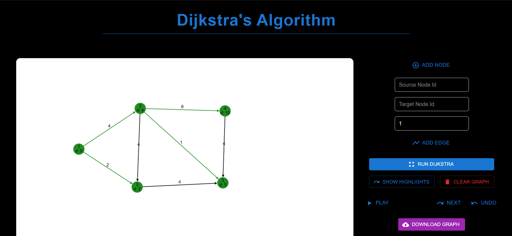

# 🛰️ Dijkstra Algorithm Visualizer

A dynamic, interactive visualization tool that demonstrates how **Dijkstra’s shortest path algorithm** works, built using **Next.js**, **Cytoscape.js**, and **React**. This project visually simulates the step-by-step pathfinding process on a graph — ideal for learners, educators, and interview prep.

---

## 🚀 Features

- 🎯 **Interactive Graph Editor**: Add and connect nodes with edge weights
- 📍 **Start & End Node Selection**
- 🔁 **Step-by-Step Execution**: Play/Pause/Next/Undo buttons to control algorithm flow
- ✨ **Live Distance Updates**: Nodes update distance labels in real time
- 🧠 **Dry Run Simulation**: Watch how the algorithm explores shortest paths
- 💅 Responsive & clean UI

---

## 🛠️ Tech Stack

- **Framework**: Next.js (React)
- **Graph Rendering**: Cytoscape.js
- **State Management**: React Hooks
- **Styling**: Tailwind CSS and Material UI for icons

---

## 📸 Screenshots

---

## 🧠 Algorithm: Dijkstra’s Shortest Path

Dijkstra’s algorithm finds the shortest path from a source node to all other nodes in a weighted graph without negative weights. This visualizer shows:
- How the **priority queue** selects the next node
- How distances are updated when a shorter path is found
- How the shortest path tree is built

---
